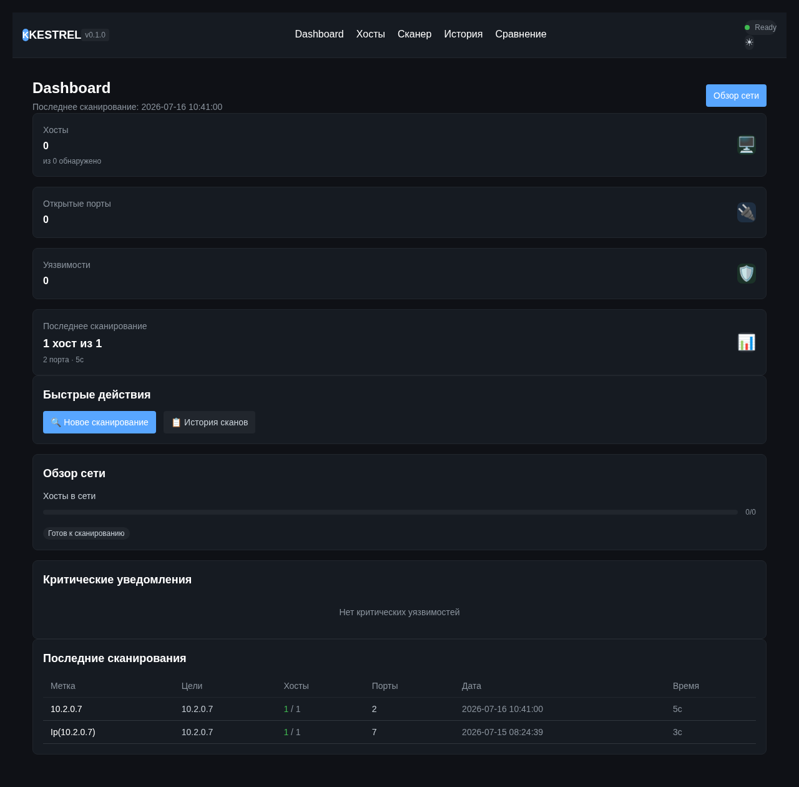
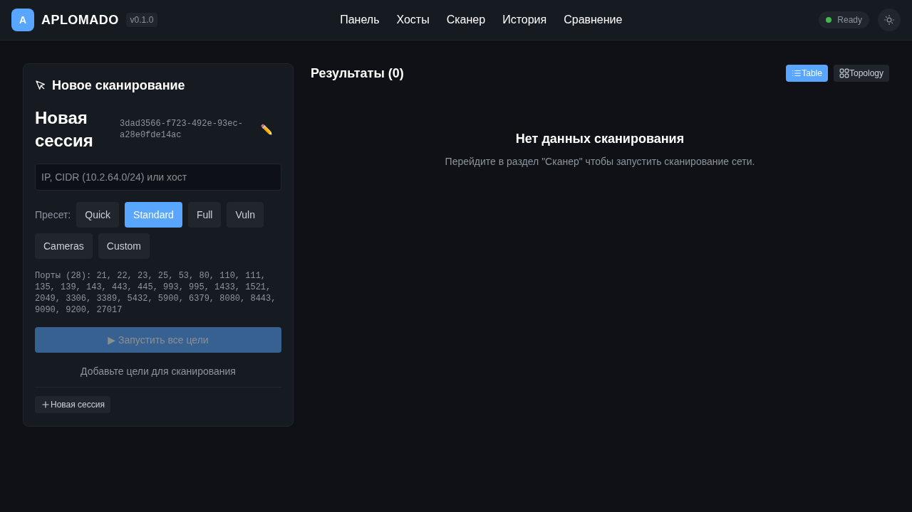
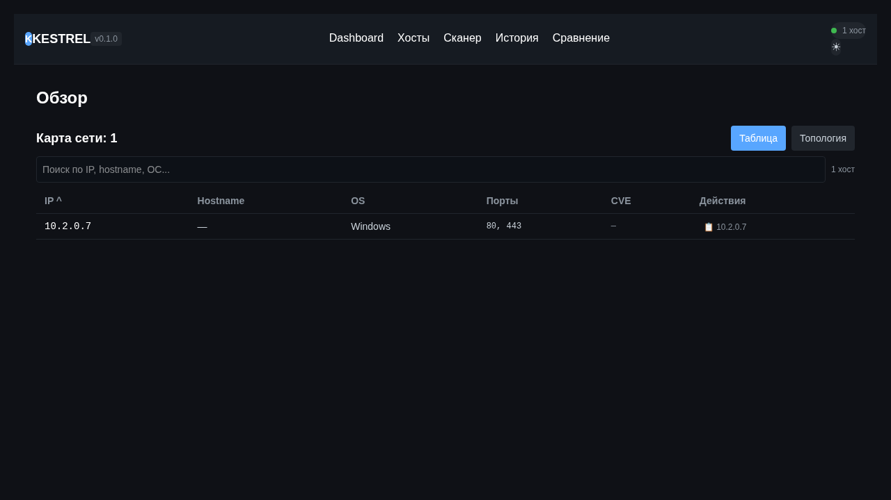
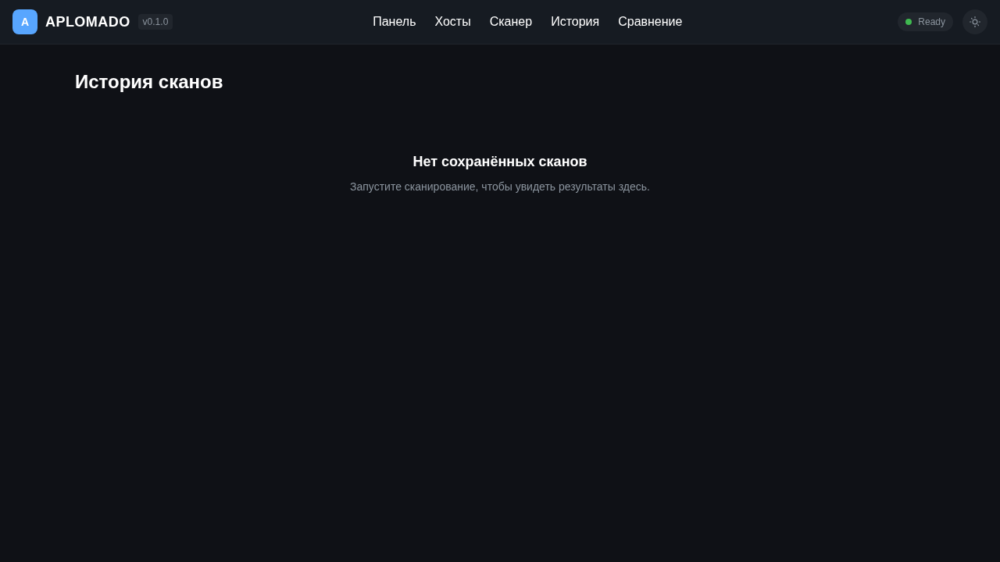
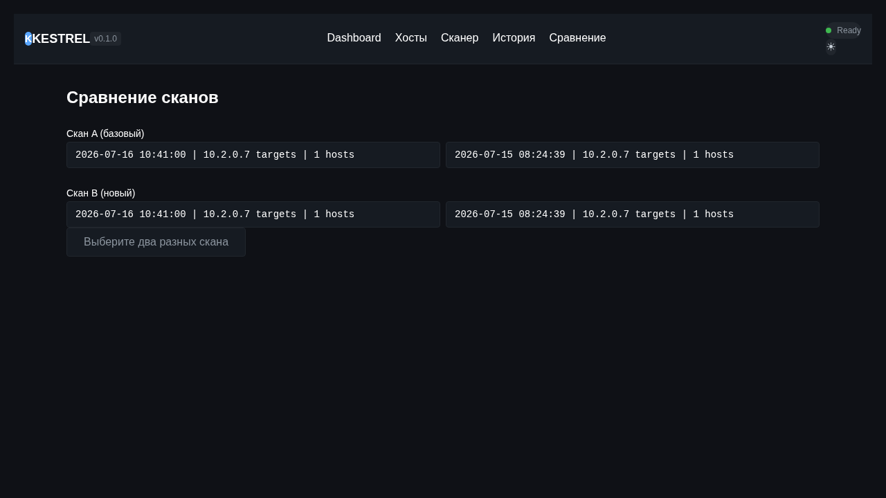

# Aplomado

**Aplomado** — это кроссплатформенный сканер уязвимостей с графическим интерфейсом, написанный на Rust с использованием Dioxus 0.7.

Он выполняет TCP-сканирование портов, захват баннеров (banner grabbing), определение ОС по баннерам, поиск CVE-уязвимостей через CIRCL API, traceroute, сохранение истории сканирования в SQLite и экспорт отчётов в HTML/JSON/TXT/CSV/ZIP.

Назван в честь **апломадо** (*Falco femoralis*) — стремительного сокола Америк, известного своей выносливостью и охотничьим мастерством.

## Возможности

- **Сканирование портов** — TCP connect scan для диапазонов IP, CIDR-сетей, hostname'ов
- **Гибкие пресеты** — Quick, Standard, Full, Vuln, Cameras + кастомные порты
- **Баннер-грейбинг** — захват баннеров SSH/HTTP/HTTPS/FTP/SMTP/MySQL/Redis
- **Определение ОС** — эвристическое определение ОС по баннерам
- **Поиск CVE** — сопоставление версий сервисов с CVE-базой CIRCL
- **Traceroute** — in-process traceroute без прав root
- **История сканирований** — SQLite-хранилище с просмотром и сравнением результатов (diff)
- **Экспорт отчётов** — HTML, JSON, TXT, CSV, ZIP
- **Тёмная/светлая тема** — встроенная поддержка обеих тем
- **Топология сети** — SVG-граф сети с dagre-компоновкой
- **Многоплатформенность** — Desktop (native), Web, Mobile (Android/iOS)

## Платформы

| Платформа | Статус | Запуск |
|-----------|--------|--------|
| **Desktop** (Linux/macOS/Windows) | ✅ Готово | `cargo run --bin aplomado -- run` |
| **Web** | ✅ Готово | `dx serve` в `packages/web/` |
| **Mobile** (Android/iOS) | 🚧 Разработка | `dx serve --platform android` |

## Скриншоты

| Dashboard | Сканирование |
|-----------|--------------|
|  |  |

| Хосты | История | Сравнение |
|-------|---------|-----------|
|  |  |  |

## Архитектура

Проект организован как Cargo workspace из 7 пакетов:

```
aplomado/
├── Cargo.toml                  # workspace root
├── packages/
│   ├── types/                  # Общие модели данных (ScanTarget, HostInfo, PortInfo, CveSummary …)
│   ├── core/                   # Бизнес-логика: сканер, fingerprint, CVE, история, экспорт, traceroute
│   ├── api/                    # Server Functions (Dioxus fullstack) — REST API для web-версии
│   ├── ui/                     # Все UI-компоненты, общие для всех платформ
│   ├── web/                    # Web-точка входа (Dioxus Web + fullstack)
│   ├── desktop/                # Desktop-точка входа + CLI (Clap)
│   └── mobile/                 # Mobile-точка входа (Android/iOS)
```

### Поток данных

```
[Desktop/Mobile/Web UI]
       │
       ▼
 ┌─────────────┐     ┌──────────────┐
 │  api (REST) │◄───►│  core        │
 │  или прямой  │     │  ├─ scanner  │
 │  вызов core  │     │  ├─ fingerprint
 └─────────────┘     │  ├─ cve      │
                     │  ├─ history  │
                     │  ├─ export   │
                     │  └─ traceroute│
                     └──────────────┘
                            │
                            ▼
                     ┌──────────────┐
                     │  SQLite (DB) │
                     └──────────────┘
```

## Быстрый старт

### Требования

- Rust 1.80+
- Tailwind CSS CLI (для пересборки CSS, опционально)

### Сборка и запуск Desktop

```bash
git clone https://github.com/anomalyco/aplomado.git
cd aplomado
cargo run --bin aplomado -- run
```

### CLI-режим

```bash
# Сканирование одного хоста
cargo run --bin aplomado -- scan 192.168.1.1

# Сканирование подсети
cargo run --bin aplomado -- scan 192.168.1.0/24

# Список истории
cargo run --bin aplomado -- list

# Детали скана
cargo run --bin aplomado -- show --last

# Экспорт отчёта
cargo run --bin aplomado -- export --last --format html

# Обновление CVE базы
cargo run --bin aplomado -- update-cve
```

### Web-версия

```bash
cd packages/web
dx serve
```

## Тестирование

```bash
# Все тесты
cargo test

# Тесты конкретного пакета
cargo test -p aplomado-core

# Тесты экспорта
cargo test -p aplomado-core --test export_tests
```

## Технологии

- **Dioxus 0.7** — UI фреймворк (web + desktop + mobile)
- **Tokio** — асинхронный рантайм
- **SQLite (Rusqlite)** — хранение истории и CVE
- **Reqwest + Rustls** — HTTP-клиент для CVE API
- **Petgraph + Dagre** — рендеринг топологии сети
- **Tailwind CSS v4** — стилизация
- **Clap** — CLI-аргументы (desktop)
- **CIRCL CVE API** — база уязвимостей

## Ограничения

- **CVE Matching** — сопоставление выполняется на основе баннеров сервисов (версий). Это даёт **ложные срабатывания** (*false positives*) — реальная версия может отличаться от указанной в баннере. Всегда проверяйте результаты вручную.
- **Traceroute** — использует UDP probe + ICMP listener. Не все сети пропускают ICMP Time Exceeded, и не все маршрутизаторы отвечают.
- **Определение ОС** — эвристическое, по баннерам сервисов. Не является надёжным методом идентификации ОС.

## Лицензия

MIT License — см. [LICENSE](LICENSE).
